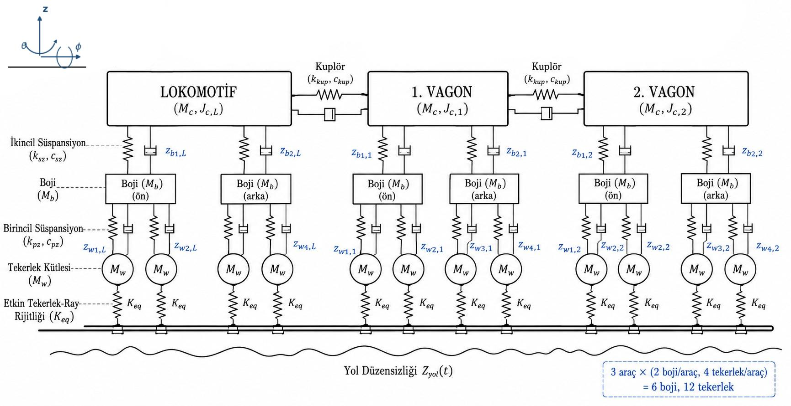
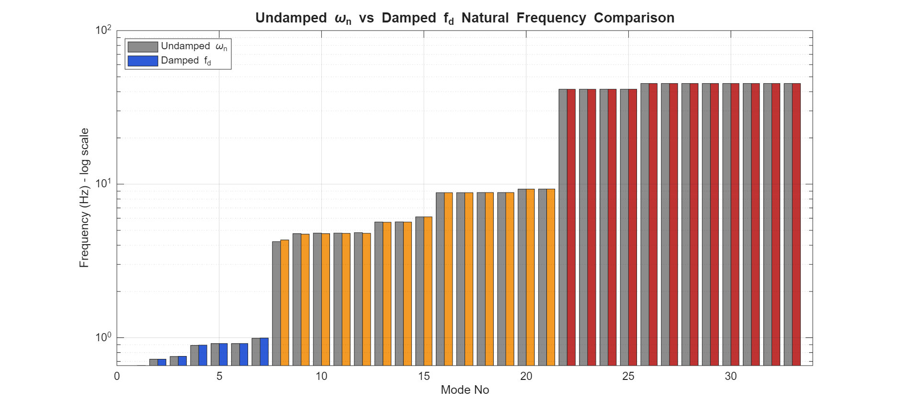
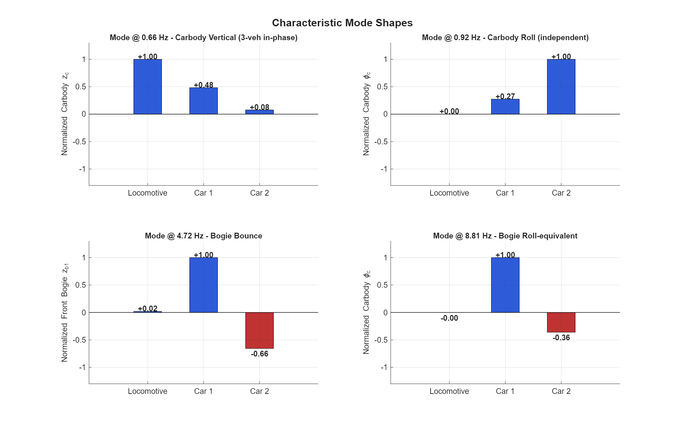

# Railway Vehicle Modal Analysis & Ride Comfort Assessment

A **33-degree-of-freedom (33-DOF)** dynamic model of a three-vehicle train consist
(one locomotive + two passenger cars) for vertical, pitch, and roll vibration analysis,
implemented in MATLAB.


---

## Overview

This project models a railway train consist as a coupled multi-body system and analyzes its
free and forced vibration behavior. The equations of motion are derived analytically using the
**Lagrangian energy method**, assembled into global mass/stiffness/damping matrices, transformed
into a **66×66 state-space system**, and solved through eigenvalue analysis.

The model goes beyond a symmetric textbook case by capturing:

- **Asymmetric mass distribution** — a heavy locomotive (85 t) coupled to lighter cars (32 t)
- **Pitch-coupled coupler dynamics** — couplers constrain both vertical and pitch motion
- **Effective wheel–rail (P2) contact resonance** via a linearized contact stiffness

Forced-vibration response is then evaluated under a realistic stochastic track profile, and
passenger comfort is graded according to international standards.

<p align="center">
  
</p>

---

## Table of Contents
- [Model Description](#model-description)
- [Methodology](#methodology)
- [Key Results](#key-results)
- [Repository Structure](#repository-structure)
- [How to Run](#how-to-run)
- [Validation](#validation)
- [Known Limitations](#known-limitations)
- [References](#references)
- [Author](#author)

---

## Model Description

Each of the three vehicles is represented with **11 DOF**, giving a total system size of
**3 × 11 = 33 DOF**:

| Component | Motion | DOF per vehicle |
|-----------|--------|:---------------:|
| Carbody   | bounce (z), pitch (θ), roll (φ) | 3 |
| Bogies (front + rear) | bounce (z_b1, z_b2), roll (φ_b1, φ_b2) | 4 |
| Wheelsets (×4) | bounce (z_w1 … z_w4) | 4 |
| **Total** | | **11** |

Vehicles are connected by spring–damper **couplers**; carbody–bogie connections use the
**secondary suspension**, and bogie–wheelset connections use the **primary suspension**.
The wheel–rail interface is modeled with an effective vertical contact stiffness *K_eq*.

---

## Methodology

```
Lagrangian energy formulation  (kinetic, potential, Rayleigh dissipation)
            │
            ▼
Global matrices  M, C, K  (33×33 each)
            │
            ▼
State-space form   ẋ = A x + B u      A = [ 0   I ; −M⁻¹K  −M⁻¹C ]   (66×66)
            │
   ┌────────┴────────┐
   ▼                 ▼
Eigenvalue        Time-domain forced
analysis          response (lsim)
(modal + stability)   (ISO 8608 input)
   │                 │
   ▼                 ▼
Natural freq.,    Wₖ-weighted RMS
damping, modes    ride comfort (ISO 2631-1)
```

---

## Key Results

### Natural frequency clusters
The 33 modes group into three physically distinct bands, consistent with railway dynamics literature:

| Mode family | Frequency range | Notes |
|-------------|:---------------:|-------|
| Carbody modes | **0.66 – 0.99 Hz** | bounce, pitch, roll (ride-comfort critical) |
| Bogie modes | **4.22 – 9.29 Hz** | primary/secondary suspension dominated |
| P2 / effective contact | **41.50 Hz (loco), 45.24 Hz (car)** | wheel–rail contact resonance (mass split) |

### Damping hierarchy
Pitch > Bounce > Roll, matching wedge-test measurements (Shi et al., 2016):

| Mode | Damping ratio ζ |
|------|:---------------:|
| Carbody pitch | 27.4 % |
| Carbody bounce | 10.5 % |
| Carbody roll | 3.6 % |
| P2 contact | ~1.2 % |

### Stability
All 66 eigenvalues lie in the left-half plane — **max Re(λ) = −0.128** — so the system is
**asymptotically stable** in the Lyapunov sense.

### Ride comfort (100 km/h, ISO 8608 Class B track)
All vehicles fall in the ISO 2631-1 **"Not Uncomfortable"** class (< 0.315 m/s²):

| Position | Wₖ-weighted RMS | Class |
|----------|:---------------:|-------|
| Locomotive (lead) | 0.034 m/s² | Not Uncomfortable |
| **Middle car** | **0.043 m/s²** | Not Uncomfortable (highest) |
| Rear car (tail) | 0.029 m/s² | Not Uncomfortable (lowest) |

> **Key finding — the mass-buffer effect:** the heavy locomotive acts as a mass damper,
> absorbing front excitation; the middle car receives coupler-transmitted energy from both
> neighbors and therefore sees the highest acceleration, while the free-end tail car is the most
> comfortable.

<p align="center">
  
  
</p>

---

## Repository Structure

```
railway-vehicle-modal-analysis/
├── README.md
├── LICENSE
├── src/
│   └── train_modal_analysis_EN.m  # complete MATLAB model and simulation
├── figures/
│   ├── system_schematic.png
│   ├── natural_frequencies.png
│   ├── frequency_groups.png
│   ├── damping_ratios.png
│   ├── eigenvalue_map.png
│   ├── mode_shapes.png
│   └── ride_comfort.png
└── docs/
    └── project_report.pdf         # full technical report (Turkish)
```

---

## How to Run

**MATLAB** (R2018b or later; requires the Control System and Signal Processing Toolboxes for the
ride-comfort simulation). The script builds the model, prints the modal table, and saves all six
analysis figures directly into the `figures/` directory:

```matlab
run(fullfile('src', 'train_modal_analysis_EN.m'))
```

The script resolves output paths from its own file location, so it can also be run directly from
the MATLAB Editor without changing the current working directory.

---

## Validation

Results are cross-checked three independent ways:

1. **Analytical hand calculation** — the P2 contact frequency from
   `f = (1/2π)·√((K_pz + K_eq)/M_w)` matches the numerical eigenvalue to within 0.1 %.
2. **Forced-response PSD** — Welch spectra of the simulated acceleration show peaks exactly at
   the computed natural frequencies (~0.92 Hz, ~4.76 Hz, 45.24 Hz).
3. **Literature comparison** — frequency bands and damping hierarchy agree with Iwnicki (2006),
   Demir (2016), and Shi et al. (2016).

---

## Known Limitations

- Single (shared) track input per wheel — left/right rail asymmetry and roll excitation via
  spatial coherence are left to future work.
- Lateral/yaw dynamics (hunting, creep forces) are outside the present scope.
- The wheel–rail contact is linearized (`K_eq`); nonlinear Hertz contact, rail-pad
  viscoelasticity, and sleeper/ballast dynamics are not included.
- Carbodies are treated as rigid; flexible-body bending modes (8–15 Hz) are neglected.
- ISO 8608 Class B is a road-roughness spectrum used here as an approximation; dedicated
  railway spectra (e.g., FRA, ORE B176) would be more precise.

---

## References

Key sources used for parameters and validation:

- Iwnicki, S. (Ed.) (2006). *Handbook of Railway Vehicle Dynamics*. CRC Press. https://doi.org/10.1201/9781420004892
- Demir, E. (2016). 3D suspension characterization of a rapid transit vehicle. *Urban Rail Transit*, 2(3-4). https://doi.org/10.1007/s40864-016-0045-x
- Shi, H., Wu, P., Luo, R., & Zeng, J. (2016). Wedge tests and damping ratio analysis. *Proc. IMechE Part F*, 230(2). https://doi.org/10.1177/0954409714542861
- Jenkins, H. H., et al. (1974). The effect of track and vehicle parameters on wheel/rail vertical dynamic forces. *Railway Engineering Journal*, 3(1). https://trid.trb.org/View/19226
- ISO 2631-1 (1997) · ISO 8608 (2016) — whole-body vibration & road-profile standards.

(See `docs/project_report.pdf` for the complete reference list.)

---

## Author

Developed as a Mechanical Vibrations (MAK 315) term project at İstanbul Technical
University, Department of Mechanical Engineering.

**Saliha Yıldız**
[LinkedIn](https://www.linkedin.com/in/yildizsaliha/) · yildizslha7@gmail.com

---

*Licensed under the MIT License — see [LICENSE](LICENSE).*
